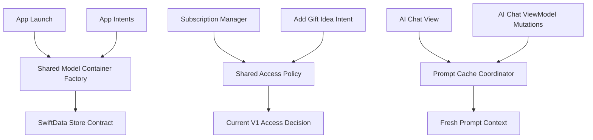

# Overview

This plan resolves four review findings that currently weaken correctness and confidence across the app:

1. The test target is not buildable because it still references deleted utilities and orphaned widget data code.
2. App Intents do not use the same SwiftData container contract as the main app, which can split reads and writes across different stores.
3. Shortcuts still apply an old paywall decision while the app currently exposes v1 access for free.
4. AI chat prompt caching only reacts to collection counts, so in-place edits can leave the next prompt stale.

The goal is not just to patch each symptom independently. The goal is to restore a single source of truth for persistence and access policy, make tests reflect the current architecture, and add enough verification that these seams do not drift again.

# Requirements

## Functional Requirements

- Restore a buildable and truthful `aiPresentsAppTests` target.
- Make App Intents and the main app resolve the same SwiftData storage contract.
- Ensure shortcut access decisions match the current v1 launch behavior exposed by the app.
- Ensure AI chat prompt generation reflects in-session data mutations, not only insertions/deletions.
- Add focused regression coverage around the repaired seams.

## Non-Goals

- No redesign of the subscription product model.
- No expansion of Siri/App Intent feature scope beyond fixing the broken contract.
- No broad AI chat architecture rewrite.
- No full rehabilitation of every currently skipped SwiftData-heavy test in one pass.
- No database migration or store format change unless implementation proves it is strictly required.

# Source Context

## Reviewed Code Paths

- `Sources/aiPresentsApp/aiPresentsApp.swift`
- `Sources/aiPresentsApp/Intents/PersonEntity.swift`
- `Sources/aiPresentsApp/Intents/AddGiftIdeaIntent.swift`
- `Sources/aiPresentsApp/Intents/UpcomingBirthdaysIntent.swift`
- `Sources/aiPresentsApp/Services/SubscriptionManager.swift`
- `Sources/aiPresentsApp/Services/WidgetDataService.swift`
- `Sources/aiPresentsApp/Views/AI/AIChatView.swift`
- `Sources/aiPresentsApp/ViewModels/AIChatViewModel.swift`
- `Tests/aiPresentsAppTests/DebouncerTests.swift`
- `Tests/aiPresentsAppTests/BirthdayWidgetDataTests.swift`

## Relevant Project Documents

- `docs/superpowers/specs/2026-03-14-siri-integration-design.md`
- `docs/superpowers/plans/2026-03-13-subscription-monetization.md`

## Institutional Knowledge

No `docs/solutions/` corpus exists in this repository, so there are no existing learnings to anchor on. This plan relies on current code, review findings, and the existing Siri and monetization docs.

## Testing Reality

The current test target is not trustworthy as a signal source:

- It does not compile because of stale references to removed types.
- Several SwiftData-heavy suites are currently skipped with `XCTSkip`, so green tests alone would still not imply full coverage of persistence-sensitive paths.

This plan therefore prioritizes restoring a truthful baseline before expanding confidence.

# Key Decisions

## 1. Shared Contracts Over Parallel Logic

The persistence contract and access-policy contract should each live in one shared implementation that is consumed by both UI-facing and intent-facing code. The review findings are both examples of duplicated logic drifting apart.

## 2. Fix Current-State Tests, Not Historical Architecture

The right response to stale tests is to delete or replace coverage that targets removed utilities, not to resurrect deleted types like `Throttler`, `DebouncedPublisher`, or `BirthdayWidgetData`.

## 3. Treat Current Product Behavior As Source of Truth

`SubscriptionManager.hasFullAccess` currently exposes a v1 free-access policy. The shortcut path should be aligned to that current contract. This work should not silently restore an earlier monetization rule from planning docs.

## 4. Preserve Prompt Caching, But Make Invalidation Semantic

The prompt cache still has value for responsiveness. The issue is not caching itself; the issue is that invalidation is too coarse. The fix should invalidate based on relevant data changes or an equivalent prompt fingerprint, rather than removing caching outright.

# Architecture Direction

# Implementation Strategy

## Workstream 1: Restore the Test Target to a Truthful Baseline

### Goal

Make `aiPresentsAppTests` compile again and ensure the suite only validates behavior that still exists in the product.

### Primary Changes

- Remove or rewrite stale sections of `Tests/aiPresentsAppTests/DebouncerTests.swift` so the file only exercises the current `Debouncer` API.
- Remove or replace `Tests/aiPresentsAppTests/BirthdayWidgetDataTests.swift`, which still targets deleted code.
- Update `ai-presents-app-ios.xcodeproj/project.pbxproj` so removed test files are not still wired into the test target.
- Add replacement coverage for live widget snapshot behavior in `Sources/aiPresentsApp/Services/WidgetDataService.swift`.

### Implementation Notes

- Prefer characterization tests for current production behavior rather than broad refactors to the test harness.
- Keep the new widget-related tests narrow and deterministic. They should validate current sort/selection/transformation rules without introducing new test-only abstractions.
- Inventory existing `XCTSkip` suites during implementation and leave explicit notes for any remaining deferred gaps.

### Verification

- `xcodebuild ... build-for-testing` completes successfully for `aiPresentsAppTests`.
- No test file references `Throttler`, `DebouncedPublisher`, or `BirthdayWidgetData`.
- Replacement widget tests execute against the current service layer.

### Risks

- The project file may still contain stale target references after file-level cleanup.
- Removing obsolete tests without adding current-state coverage would improve build health but not confidence, so both actions must land together.

## Workstream 2: Centralize the SwiftData Container Contract

### Goal

Guarantee that App Intents and the main app resolve the same schema, store name, and CloudKit/local persistence decision.

### Primary Changes

- Extract the app’s model-container creation into a shared utility, for example `Sources/aiPresentsApp/Utilities/AppModelContainerFactory.swift`.
- Refactor `Sources/aiPresentsApp/aiPresentsApp.swift` to consume that factory instead of owning unique setup logic.
- Refactor `Sources/aiPresentsApp/Intents/PersonEntity.swift` and intent callers to use the same factory/contract rather than constructing an independent container with `.none`.
- Verify that `Sources/aiPresentsApp/Intents/AddGiftIdeaIntent.swift` and `Sources/aiPresentsApp/Intents/UpcomingBirthdaysIntent.swift` only access persistence through the shared contract.

### Implementation Notes

- Preserve the app’s current local-vs-iCloud decision rules and fallback behavior exactly; centralization should remove drift, not change behavior.
- Keep the factory surface intentionally small: schema, configuration name, CloudKit selection, and failure behavior.
- If the intent runtime imposes an environment-specific constraint, encode that explicitly in the shared contract rather than branching ad hoc in intent files.

### Verification

- Unit tests assert that app-facing and intent-facing callers resolve the same effective store configuration.
- Manual or smoke verification confirms that a gift idea created via shortcut becomes visible in the main app and that person lookup returns the same records the app sees.
- The Siri integration spec remains true after implementation rather than aspirational.

### Risks

- SwiftData multi-process behavior can be subtle, especially around CloudKit-backed configurations.
- A naive extraction could accidentally change initialization timing or fallback semantics in `aiPresentsApp.swift`.

## Workstream 3: Unify Access Policy Across UI and Shortcuts

### Goal

Remove monetization-rule drift by making shortcut access decisions derive from the same policy as the app.

### Primary Changes

- Extract a shared access-policy evaluation surface, likely adjacent to `Sources/aiPresentsApp/Services/SubscriptionManager.swift`.
- Update `SubscriptionManager` to expose the policy in a reusable way rather than keeping the canonical decision trapped in app-only state.
- Refactor `Sources/aiPresentsApp/Intents/AddGiftIdeaIntent.swift` to evaluate access through the same policy instead of duplicating trial/purchase logic.

### Implementation Notes

- The implementation should codify today’s v1 launch rule in one place.
- The shared access policy should be easy to test without UI dependencies or StoreKit runtime requirements.
- The old monetization plan should be treated as future context, not as the runtime contract for this fix.

### Verification

- App and shortcut code paths return the same access result for the same subscription state.
- A user who currently has free access in the app is not blocked by the shortcut path.
- Tests cover both the current free-launch behavior and the path for future reinstatement of stricter gating.

### Risks

- If access logic is partly asynchronous or tied to actor-isolated state, the shared policy needs a deliberately testable boundary.
- Fixing only the shortcut path without centralizing policy would leave the repo vulnerable to the same drift recurring later.

## Workstream 4: Make AI Prompt Invalidation Follow Real Data Changes

### Goal

Prevent stale AI context after in-place edits while preserving the performance benefit of prompt reuse.

### Primary Changes

- Expand invalidation logic in `Sources/aiPresentsApp/Views/AI/AIChatView.swift` beyond collection counts.
- Ensure `Sources/aiPresentsApp/ViewModels/AIChatViewModel.swift` invalidates prompt state after mutations triggered from chat actions.
- Add focused tests that prove the next prompt reflects status and metadata changes performed during an open chat session.

### Implementation Notes

- The lowest-risk implementation is to centralize prompt invalidation behind one method and call it from every mutation path that changes prompt-relevant state.
- If count-based observation is retained, it should be supplemented by a content fingerprint or explicit mutation callbacks.
- Avoid scattering prompt-cache knowledge across many unrelated view-model methods. The repair should reduce hidden coupling.

### Verification

- Changing a gift’s status from the chat updates the context seen by the next prompt.
- Editing prompt-relevant fields like relation, hobby, or title while the chat remains open invalidates cached prompt material.
- Repeated sends with no relevant state change may still reuse cached content.

### Risks

- Over-invalidation could reduce responsiveness, but stale AI guidance is the more severe failure mode.
- Under-invalidation will appear intermittent and be difficult to notice without targeted tests.

## Workstream 5: Lock In the Repaired Contracts With Documentation and Smoke Coverage

### Goal

Make the new persistence and access contracts explicit so future contributors do not reintroduce drift.

### Primary Changes

- Update `docs/superpowers/specs/2026-03-14-siri-integration-design.md` so the shared container contract is documented as implemented architecture.
- Add a short developer note in the repo docs describing the new shared container/access-policy rule and the intended verification path.
- Mark any outdated monetization assumptions in `docs/superpowers/plans/2026-03-13-subscription-monetization.md` if that document currently reads like active runtime behavior.
- Add narrow smoke coverage around the repaired cross-cutting seams if it can be done without bloating the suite.

### Implementation Notes

- Documentation should describe the rules future code must follow, not restate implementation details file by file.
- Where a larger deferred gap remains, capture it explicitly rather than letting the new plan imply a stronger confidence level than the tests justify.

### Verification

- Repo docs no longer contradict runtime behavior for Siri persistence or current access policy.
- The repaired seams have at least one direct test or smoke check each.

# System-Wide Impact

## Persistence Layer

This work introduces a single persistence contract for app and intent code. Any future widget, intent, or background integration that touches SwiftData should be required to enter through the same factory or helper layer.

## Product Policy

This work elevates “who has access” from duplicated logic to a first-class policy. That reduces the chance that different entry points silently enforce different product rules.

## AI Interaction Quality

This work improves trust in AI outputs by making prompt inputs match on-screen state after user actions. That matters more than raw latency because stale suggestions create invisible correctness failures.

## Test Confidence

This plan should convert the test target from “currently broken and partly stale” to “buildable, narrower, and materially more truthful,” even if some larger SwiftData integration gaps remain deferred.

# Risks and Mitigations

## Risk: Shared container extraction accidentally changes app startup behavior

Mitigation: make extraction behavior-preserving first, covered by small focused tests and simulator verification before any cleanup refactors.

## Risk: SwiftData integration still has edge cases not covered by simulator tests

Mitigation: keep the shared factory minimal, test contract-level behavior directly, and document any remaining environment-sensitive paths as residual risk.

## Risk: Fixing shortcut access by copying current logic creates another future drift point

Mitigation: require shortcut code to call the same access-policy surface rather than reimplementing conditions.

## Risk: AI prompt invalidation fix becomes too implicit

Mitigation: prefer one explicit invalidation surface and targeted tests covering mutation-triggered refresh behavior.

# Delivery Sequence

## Phase 1

Repair the test target so the codebase has a trustworthy verification baseline.

## Phase 2

Centralize persistence and access contracts, because those two findings are both examples of product behavior splitting across entry points.

## Phase 3

Repair AI chat invalidation and then update docs and smoke coverage to lock in the new contracts.

This sequence keeps the highest-signal verification path available as early as possible while the cross-cutting fixes are still in flight.

# Verification Plan

## Automated

- `xcodebuild -project ai-presents-app-ios.xcodeproj -scheme aiPresentsApp -destination 'platform=iOS Simulator,OS=26.2,name=iPhone 16 Pro' build-for-testing`
- Targeted test execution for any new or updated suites around:
  - Debouncer behavior
  - Widget data snapshot behavior
  - Shared model-container contract
  - Shared access policy
  - AI prompt invalidation

## Manual

- Run the add-gift shortcut path and verify the created idea appears in the main app.
- Validate that shortcut person lookup sees the same records as the app UI.
- Update gift status via AI chat action and verify the next AI response reflects the new state.

## Exit Criteria

- The test target builds successfully.
- No stale tests remain wired to deleted production types.
- App and intent persistence use the same contract.
- UI and shortcut access decisions match for the same user state.
- AI chat no longer uses stale prompt context after in-place edits.

# Open Questions

These questions do not block planning, but they should be resolved intentionally during implementation:

- Whether the shared container helper should live in `Utilities` or a more explicit persistence-focused namespace.
- Whether the remaining `XCTSkip` suites should stay deferred after this repair or whether one additional SwiftData-heavy path is cheap enough to re-enable now.
- Whether the best long-term verification for shortcut persistence should include a small dedicated smoke test harness beyond unit tests and simulator flows.

# Recommended Next Step

Execute this as one coordinated remediation pass rather than four isolated fixes. The persistence and access findings share the same root cause pattern, and the test-target repair should happen first so later work has a usable verification baseline.
